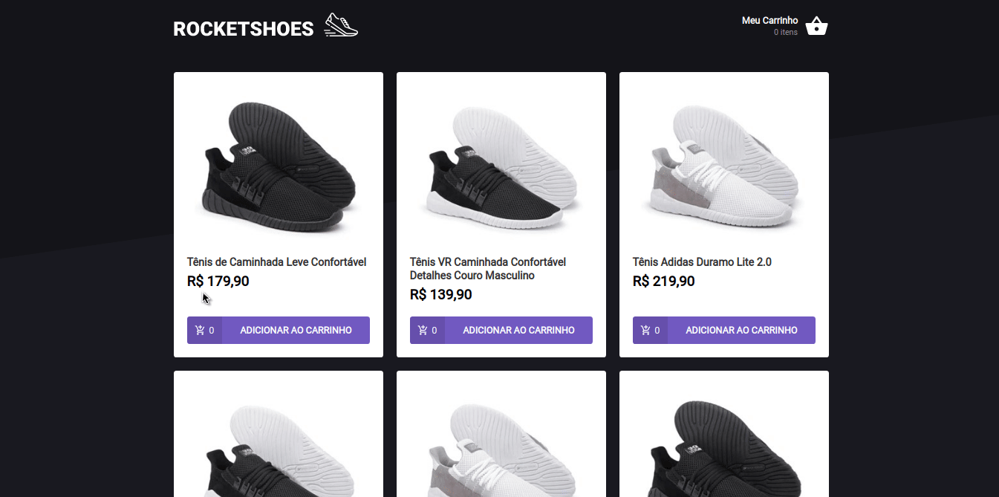

# Rocketshoes

It is a NetShoes clone application developed using React and Redux

## Built With

- [ReactJS](https://reactjs.org/)
- [Redux](https://reactjs.org/)
- [styled-components](https://www.styled-components.com/)
- [react-icons](https://react-icons.netlify.com/)
- [Axios](https://github.com/axios/axios)
- [Immer](https://github.com/immerjs/immer)
- [Polished](https://polished.js.org/)
- [react-tostify](https://fkhadra.github.io/react-toastify/)
- [json-server](https://github.com/typicode/json-server)
- [Reactotron](https://infinite.red/reactotron)
- [VSCode](https://code.visualstudio.com/)

## Getting Started

These instructions will get you a copy of the project up and running on your local machine for development and testing purposes. To clone and run this application, you'll need Git, Node.js v10.16 or higher + Yarn v1.13 or higher installed on your computer.

### Installing

    # Clone this repository

    $ git clone https://github.com/saaddalida/rocketshoes-react

    # Go into the repository

    $ cd rocketshoes-react

    # Install dependencies

    $ yarn install

    # Run the app

    $ yarn start

## Authors

- **Dalida Saad** - [Twitter](https://twitter.com/dalida_saad)

## License

This project is licensed under the MIT License.
